# index

## About

This is a tutorial about how to make games with [jMonkeyEngine3](https://jmonkeyengine.org), it's all in Chinese. For English speaker who is reading this document, I sugguest you go to [https://jmonkeyengine.github.io/wiki](https://jmonkeyengine.github.io/wiki) for more information.

* Website: [http://jmonkeyengine.org/](http://jmonkeyengine.org/)
* Forum: [https://hub.jmonkeyengine.org](https://hub.jmonkeyengine.org)
* Github: [https://github.com/jMonkeyEngine/jmonkeyengine](https://github.com/jMonkeyEngine/jmonkeyengine)
* wiki: [https://jmonkeyengine.github.io/wiki](https://jmonkeyengine.github.io/wiki)

## 关于

本教程的主要内容是介绍如何使用 jMonkeyEngine 进行游戏开发，旨在帮助初学者快速理解 jMonkeyEngine 中的核心概念。由于作者本人水品有限，文中难以避免出现谬误，如您在阅读过程中发现有不对的地方，请告知本人，我会尽快修正。

jME3官方网站：

* 官网: [http://jmonkeyengine.org/](http://jmonkeyengine.org/)
* 论坛: [https://hub.jmonkeyengine.org](https://hub.jmonkeyengine.org)
* Github: [https://github.com/jMonkeyEngine/jmonkeyengine](https://github.com/jMonkeyEngine/jmonkeyengine)
* Wiki: [https://jmonkeyengine.github.io/wiki](https://jmonkeyengine.github.io/wiki)

中文网站：

* 中文站: [http://www.jmecn.net](http://www.jmecn.net)
* 中文论坛: [http://bbs.jmecn.net](http://bbs.jmecn.net)
* QQ讨论群: 423979787
* 作者邮箱: 115050813@qq.com

[本教程设计大纲](https://github.com/viviante/tutorial-for-beginners/tree/bc61514b1c3bbe82f0aacefb8f8280f4a7cabc86/about-this-tutorial/README.md)

## 前言

[前言：我想做游戏](https://github.com/viviante/tutorial-for-beginners/tree/bc61514b1c3bbe82f0aacefb8f8280f4a7cabc86/preface-i-want-to-make-game/README.md)

## 目录

[第一章：jME3简介](https://github.com/viviante/tutorial-for-beginners/tree/bc61514b1c3bbe82f0aacefb8f8280f4a7cabc86/chapter-1-introduce-jme3/README.md)

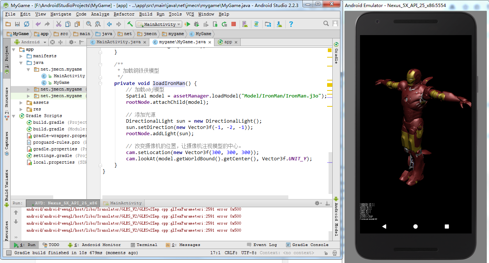

* 1.1 概述
* 1.2 jME3 SDK
* 1.3 获取jME3
* 1.4 官方教程和例子

[第二章：JME3基本概念](https://github.com/viviante/tutorial-for-beginners/tree/bc61514b1c3bbe82f0aacefb8f8280f4a7cabc86/chapter-2-basic-concepts/README.md)

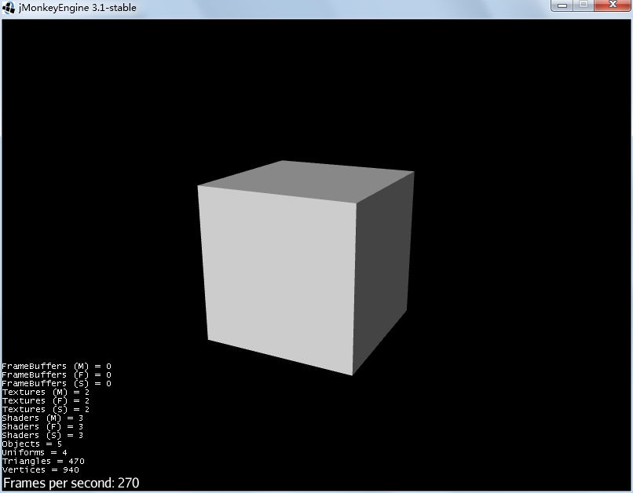

* 2.1 应用程序主类SimpleApplication
* 2.2 生命周期
* 2.3 主循环
* 2.4 场景结构 Spatial、Node、Geometry
* 2.5 资源管理 AssetManager
* 2 .6 输入管理 InputManager
* 2.7 状态机管理 AppStateManager

[第三章：模型](https://github.com/viviante/tutorial-for-beginners/tree/bc61514b1c3bbe82f0aacefb8f8280f4a7cabc86/chapter-3-model/README.md)

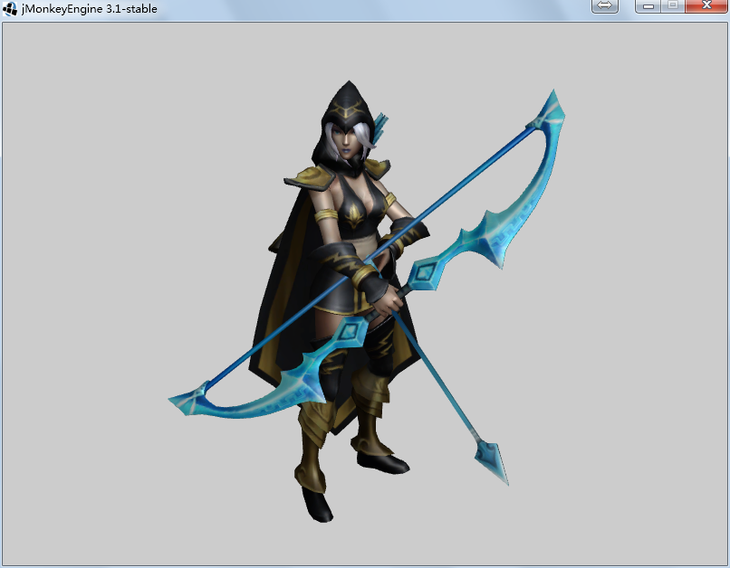

* 3.1 理解3D模型
* 3.2 模型的来源
* 3.3 实例：寒冰射手-艾希
* 3.4 实例：加载3D模型

[第四章：网格](https://github.com/viviante/tutorial-for-beginners/tree/bc61514b1c3bbe82f0aacefb8f8280f4a7cabc86/chapter-4-mesh/README.md)

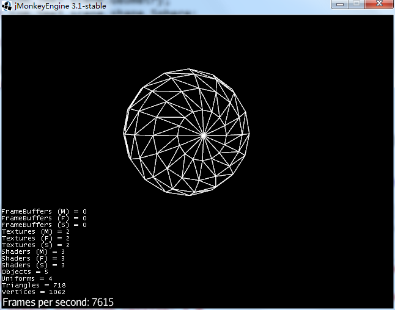

* 4.1 定义模型的形状
* 4.2 实例：自定义网格
* 4.3 程序生成网格
* 4.4 扩展阅读：渲染管线

[第五章：材质，障眼法](https://github.com/viviante/tutorial-for-beginners/tree/bc61514b1c3bbe82f0aacefb8f8280f4a7cabc86/chapter-5-material-the-light-magic/README.md)

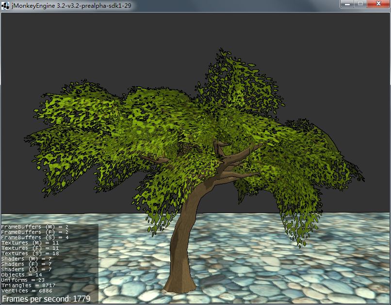

* 5.1 五色令人目盲
* 5.2 jME3的材质
* 5.3 加载j3md材质
* 5.4 改变材质参数
* 5.5 扩展阅读：UV坐标

[第六章：材质系统](https://github.com/viviante/tutorial-for-beginners/tree/bc61514b1c3bbe82f0aacefb8f8280f4a7cabc86/chapter-6-material-system/README.md)

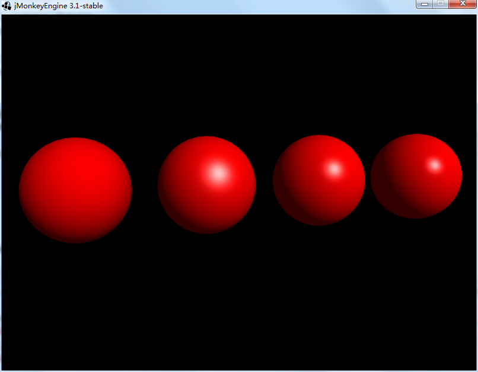

* 6.1 材质系统
* 6.2 材质实例：j3m文件
* 6.3 材质模板：j3md文件
* 6.4 附录

[第七章：光与影](https://github.com/viviante/tutorial-for-beginners/tree/bc61514b1c3bbe82f0aacefb8f8280f4a7cabc86/chapter-7-light-and-shadow/README.md)

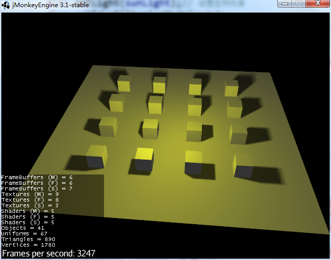

* 7.1 感受光影
* 7.2 光源
* 7.3 阴影
* 7.4 光与材质

[第八章：场景图](https://github.com/viviante/tutorial-for-beginners/tree/bc61514b1c3bbe82f0aacefb8f8280f4a7cabc86/chapter-8-scene-graph/README.md)

* 8.1 概念
* 8.2 实例：HelloNode
* 8.3 Node
* 8.4 遍历场景图

[第九章：用户交互](https://github.com/viviante/tutorial-for-beginners/tree/bc61514b1c3bbe82f0aacefb8f8280f4a7cabc86/chapter-9-user-interaction/README.md)

* 9.1 键盘、鼠标、手柄、触屏
* 9.2 ActionListener
* 9.3 RawInputListener
* 9.4 动作触发器

[第十章：图形用户界面](https://github.com/viviante/tutorial-for-beginners/tree/bc61514b1c3bbe82f0aacefb8f8280f4a7cabc86/chapter-10-graphics-user-interface/README.md)

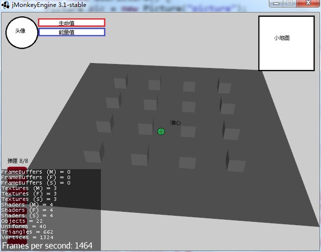

* 10.1 GuiNode
* 10.2 屏幕坐标系
* 10.3 BitmapFont
* 10.4 Lemur GUI插件

[第十一章：3D音效](https://github.com/viviante/tutorial-for-beginners/tree/bc61514b1c3bbe82f0aacefb8f8280f4a7cabc86/chapter-11-3d-audio/README.md)

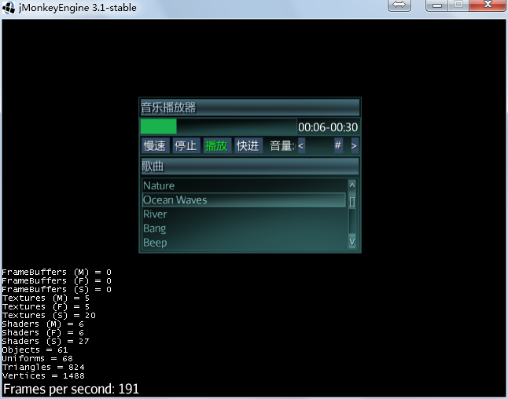

* 11.1 3D音效
* 11.2 音效系统分析

[第十二章：动画](https://github.com/viviante/tutorial-for-beginners/tree/bc61514b1c3bbe82f0aacefb8f8280f4a7cabc86/chapter-12-animation/README.md)

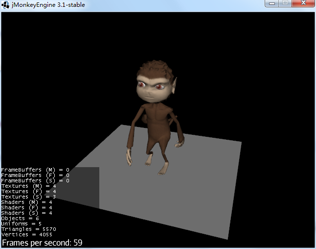

* 12.1 概述
* 12.2 骨骼蒙皮动画
* 12.3 播放动画
* 12.4 操纵骨骼
* 12.5 运动路径
* 12.6 剧情动画 （未完成）

[第十三章：控制游戏逻辑](https://github.com/viviante/tutorial-for-beginners/tree/bc61514b1c3bbe82f0aacefb8f8280f4a7cabc86/chapter-13-controlling-game-logic/README.md)

* 13.1 导读：游戏主循环
* 13.2 jME3的主循环
* 13.3 AppState
* 13.4 Control
* 13.5 多线程优化

[第十四章：特效](https://github.com/viviante/tutorial-for-beginners/tree/bc61514b1c3bbe82f0aacefb8f8280f4a7cabc86/chapter-14-special-effects/README.md)

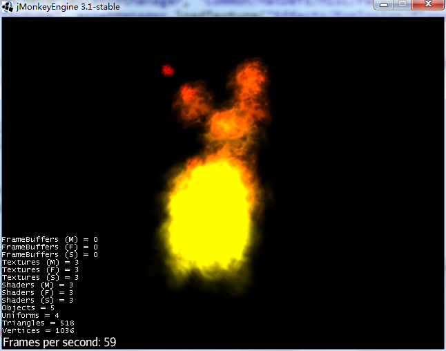

* 14.1 特效概述
* 14.2 后期滤镜
* 14.3 场景处理器
* 14.4 粒子系统
* 14.5 性能问题

[第十五章：碰撞检测](https://github.com/viviante/tutorial-for-beginners/tree/bc61514b1c3bbe82f0aacefb8f8280f4a7cabc86/chapter-15-collision-detection/README.md)

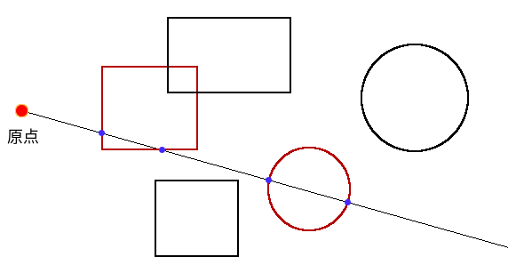

* 15.1 碰撞与相交
* 15.2 Collidable
* 15.3 jME3中的射线检测
* 15.4 jME3中的包围体
* 15.5 模拟物理现象

[第十六章：物理引擎](https://github.com/viviante/tutorial-for-beginners/tree/bc61514b1c3bbe82f0aacefb8f8280f4a7cabc86/chapter-16-physics-engine/README.md)

* 16.1 牛顿的苹果
* 16.2 物理引擎概述
* 16.3 Bullet物理引擎
* 16.4 Dyn4j物理引擎

[第十七章：户外场景](https://github.com/viviante/tutorial-for-beginners/tree/bc61514b1c3bbe82f0aacefb8f8280f4a7cabc86/chapter-17-outdoor-scene/README.md)

* 17.1 天空
* 17.2 水面
* 17.3 地形
* 17.4 实例：户外场景

## 附录

1. [jME3的历史](https://github.com/viviante/tutorial-for-beginners/tree/bc61514b1c3bbe82f0aacefb8f8280f4a7cabc86/appendix-1-jme3-history/README.md)
2. [3D游戏术语](https://github.com/viviante/tutorial-for-beginners/tree/bc61514b1c3bbe82f0aacefb8f8280f4a7cabc86/appendix-2-3d-game-terminology/README.md)
3. [jME3中的数学](https://github.com/viviante/tutorial-for-beginners/tree/bc61514b1c3bbe82f0aacefb8f8280f4a7cabc86/appendix-3-math-in-jme3/README.md)

