# 目录

## 关于本教程

## 前言：我想做游戏

## [1. jME3简介](http://blog.jmecn.net/chapter-1-introduce-jme3/)

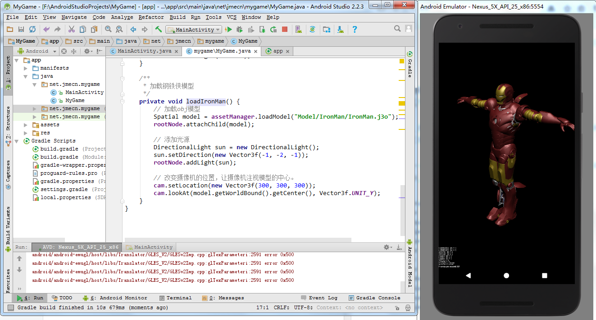

1.1 概述 1.2 jME3 SDK 1.3 获取jME3 1.4 官方教程和例子

## [2. JME3基本概念](http://blog.jmecn.net/chapter-2-basic-concepts/)

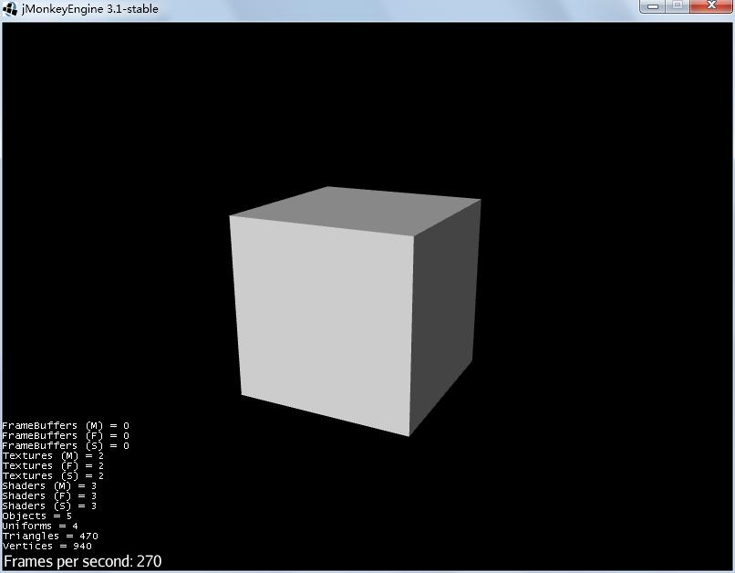

2.1 应用程序主类SimpleApplication 2.2 生命周期 2.3 主循环 2.4 场景结构 Spatial、Node、Geometry 2.5 资源管理 AssetManager 2.6 输入管理 InputManager 2.7 状态机管理 AppStateManager

## [3. 模型](http://blog.jmecn.net/chapter-3-model/)

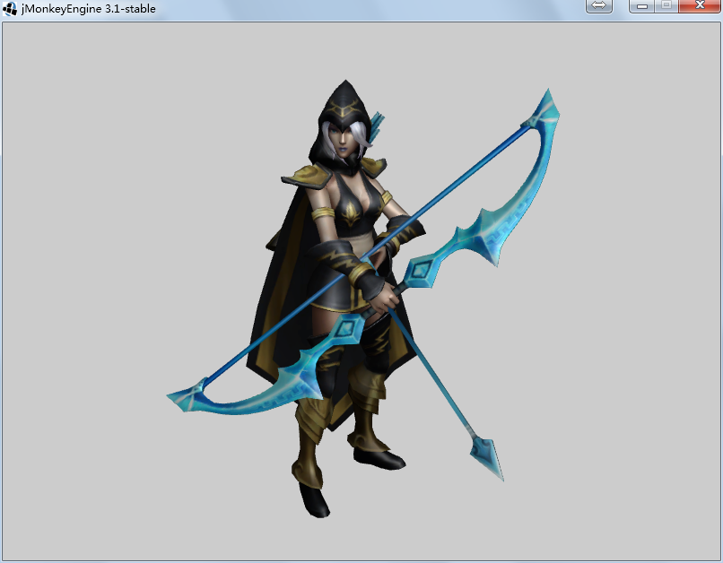

3.1 理解3D模型 3.2 模型的来源 3.3 实例：寒冰射手-艾希 3.4 实例：加载3D模型

## [4. 网格](http://blog.jmecn.net/chapter-4-mesh/)

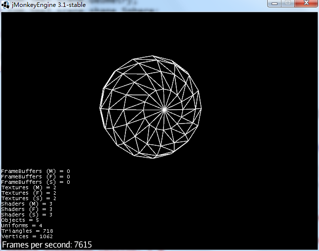

4.1 定义模型的形状 4.2 实例：自定义网格 4.3 程序生成网格 4.4 扩展阅读：渲染管线

## [5. 材质，障眼法](http://blog.jmecn.net/chapter-5-material-the-light-magic/)

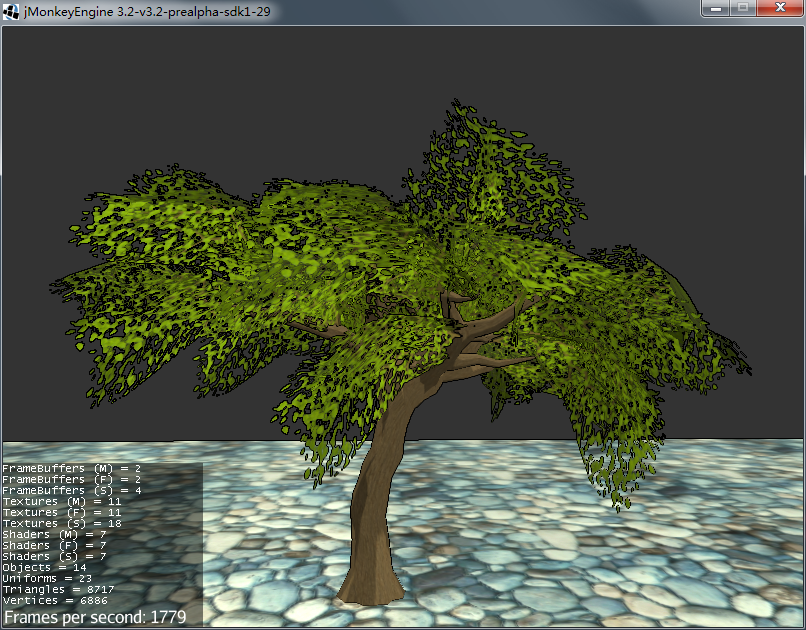

5.1 五色令人目盲 5.2 jME3的材质 5.3 加载j3md材质 5.4 改变材质参数 5.5 扩展阅读：UV坐标

## [6. 材质系统](http://blog.jmecn.net/chapter-6-material-system/)

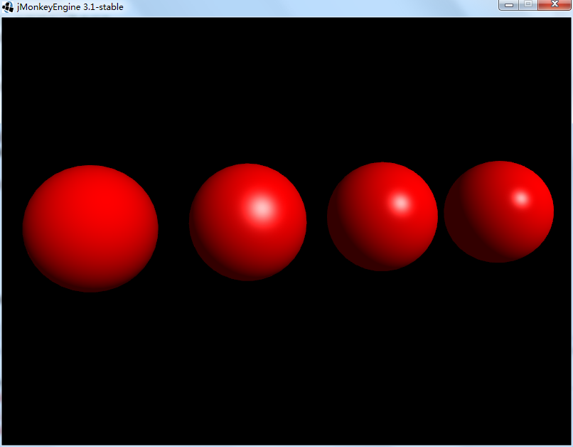

6.1 材质系统 6.2 材质实例：j3m文件 6.3 材质模板：j3md文件 6.4 附录

## [7. 光与影](http://blog.jmecn.net/chapter-7-light-and-shadow/)

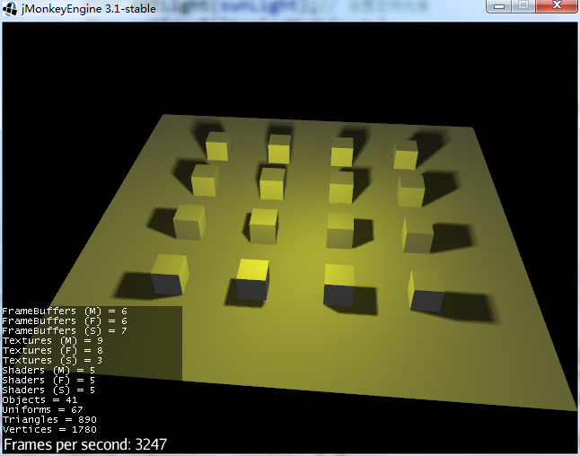

7.1 感受光影 7.2 光源 7.3 阴影 7.4 光与材质

## [8. 场景图](http://blog.jmecn.net/chapter-8-scene-graph/)

8.1 概念 8.2 实例：HelloNode 8.3 Node 8.4 遍历场景图

## [9. 用户交互](http://blog.jmecn.net/chapter-9-user-interaction/)

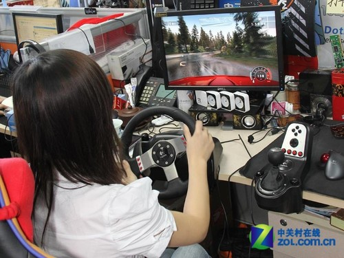

9.1 键盘、鼠标、手柄、触屏 9.2 ActionListener 9.3 RawInputListener 9.4 动作触发器

## [10. 图形用户界面](http://blog.jmecn.net/chapter-10-graphics-user-interface/)

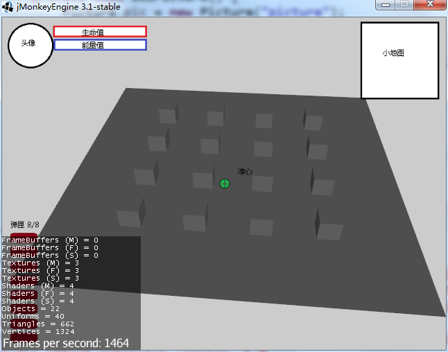

10.1 GuiNode 10.2 屏幕坐标系 10.3 BitmapFont 10.4 Lemur GUI插件

## [11. 3D音效](http://blog.jmecn.net/chapter-11-3d-audio/)

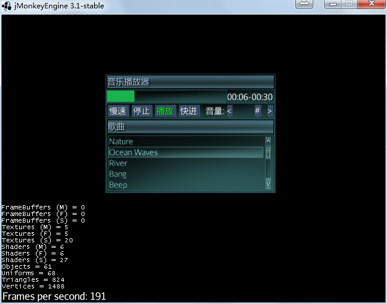

11.1 3D音效 11.2 音效系统分析

## [12. 动画](http://blog.jmecn.net/chapter-12-animation)

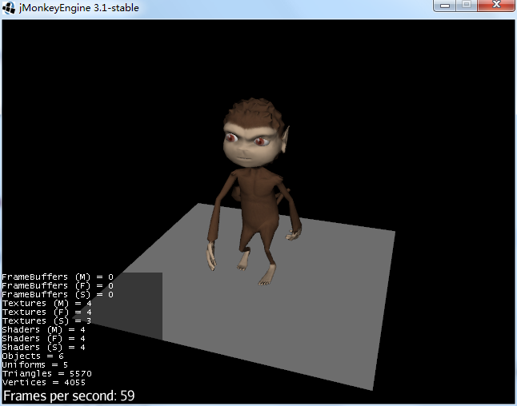

12.1 概述 12.2 骨骼蒙皮动画 12.3 播放动画 12.4 操纵骨骼 12.5 运动路径 12.6 剧情动画

## [13. 控制游戏逻辑](http://blog.jmecn.net/chapter-13-controlling-game-logic)

 13.1 导读：游戏主循环 13.2 jME3的主循环 13.3 AppState 13.4 Control 13.5 多线程优化

## [14. 特效](http://blog.jmecn.net/chapter-14-special-effects/)

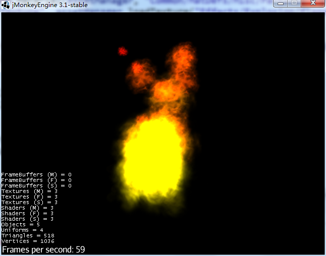 14.1 特效概述 14.2 后期滤镜 14.3 场景处理器 14.4 粒子系统 14.5 性能问题

## [15. 碰撞检测](http://blog.jmecn.net/chapter-15-collision-detection)

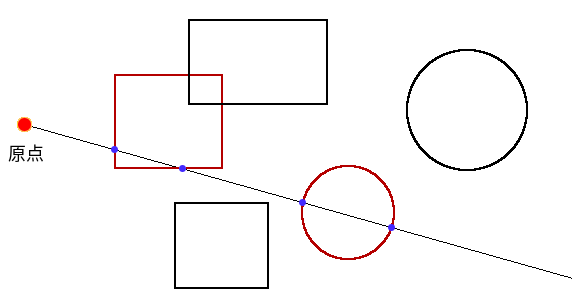 15.1 碰撞与相交 15.2 Collidable 15.3 jME3中的射线检测 15.4 jME3中的包围体 15.5 模拟物理现象

## [16. 物理引擎](http://blog.jmecn.net/chapter-16-physics-engine)

16.1 牛顿的苹果 16.2 Bullet的物理空间 16.3 刚体碰撞 16.4 创建一个胶囊体 16.5 控制模型在地图中走动

## [17. 户外场景](http://blog.jmecn.net/chapter-17-outdoor-scene)

17.1 创建一个户外场景 17.2 天空 17.3 地形 17.4 水面

## 附录I：jME3的历史

## 附录II：3D游戏术语

## 附录III：jME3中的数学

